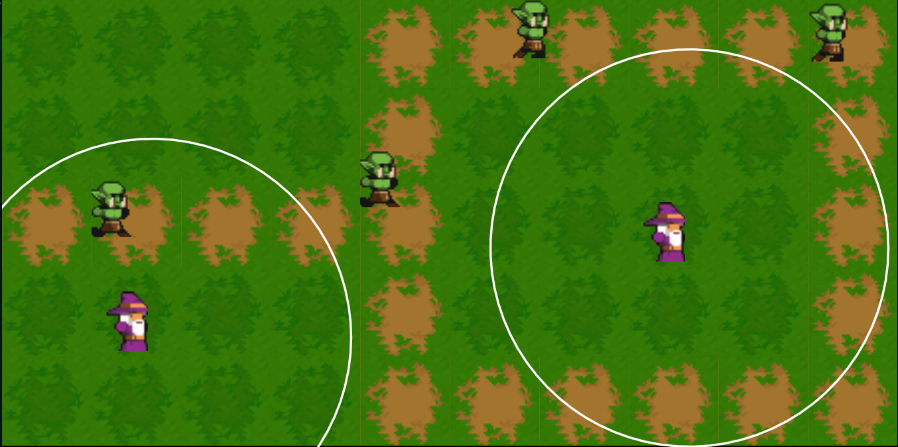

# neverOneTD
Purpose of the project was learn main concepts of Lua language and write simple application in it.

Now game looks like this:


## Getting started

Game is written with love2d. You need to install [it](https://love2d.org/) and clone this repo.

After you need to

```
1. cd <path-to-repo>/neverOneTD
2. love .
```

Congrats! You can try it!

## Notes

**Finished**:

    - [X] draw map (grass and road tiles);
    - [X] enemies with basic logic and animation;
    - [X] towers logic and set location to center of grass tiles;
    - [X] enemy health bar;

**To-do**:

    - extend map (add assets of wall with torchs);
    - add cave (it will be finish point);
    - decorate map;
    - add timer at the left top corner;
